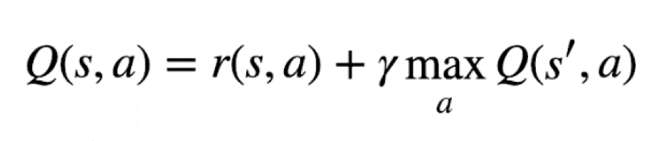
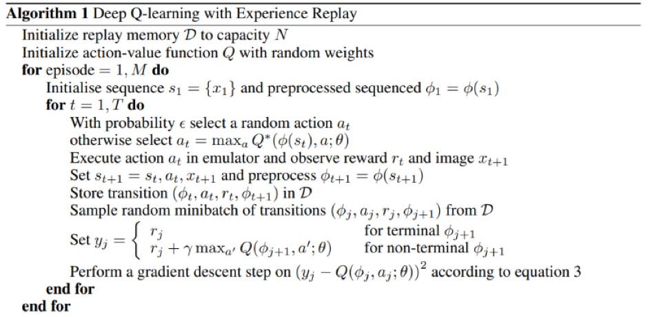

# Deep-Q-Network

The project implements Deep Q-Network (DQN) with experience replay as our deep reinforcement learning model to train the agent to play the space invaders game that was imported from the Open-AI gym retro. It is important to note that the DQN is an existing deep reinforcement model which is trained with a variant of Q-learning algorithm using the RMSprop optimizer to update its parameters, as it was chosen by a group of Deepmind researchers in the paper for the Nature [1,2].

## Deep Q-learning with experience replay

The architecture of the network takes the last 4 video frames and feeds them into convolutional layers that are followed by fully connected layers to compute the Q values for each action. In space invaders game, there are only 8 Q values since the agent can only perform 8 actions.

The Atari network architecture is shown below. It should be noted that the network architecture was mainly based on the DeepMind articles [1,2]. The only difference is that this neural network takes an input of a 105 x 80 x 4 image whereas the network mentioned in the articles first pre-process the image to an image of 110 x 84 x 1 and then crops the image to 84 x 84 x 1, and lastly stacks 4 frames in order to achieve the inputs of 84 x 84 x 4.

The reason why we would want to pre-process the image is because the input image is in the form of 210 x 160 x 3, and it consists of 3 dimensions because of the RGB values. Therefore, we want to reduce the complexity by reducing it to grayscale image which results in an input of 210 x 160 x 1, and then downscale the image size to 105 x 80 x 1 which helps a lot with speeding up the process of learning.

It was previously mentioned that we use a stack of 4 frames that are fed into our convolutional network. For example, let's consider an example where we feed a single frame of 105 x 80 x 1 to the network that is trying to learn the 'SpaceInvaders-Atari2600' game. With just one frame, it is impossible for an agent to know the direction of other agents' attacks or how fast it is going. Thus, using a stack of four frames it can give an agent the sense of motion and speed that is necessary for the network to have a full understanding of the environment.

The input 105 x 80 x 4 is fed into the first convolutional layer of 32 of 8x8 filters, it is then passed respectively to the second layer of 64 of 4x4 filters and the third layer of 64 of 3x3 filters. Subsequently, the data is flattened, resulting in a fully collected layer (dense) of 512 units that is connected to the output layer of 8 units (one output unit for each potential action). It is important to note that all convolutional layers allow padding; that is, the first layer has a stride of 4, the second has a stride of 2 and the last convolutional layer has a stride of 1. Additionally, all hidden layers (3 convo layers and 512 hidden unit dense layer) use rectified linear unit (ReLU) activation function.

## Deep reinforcement learning model

In the second part, we explained the network architecture in more detail and the logic behind it. BEfore, we get into more details of our deep reinforcement learning, it is important to menton the bellman equation as shown in Eq. (1). The bellman equation is used to assess the q-value, also known as quality, of a given action-state pair. It states that the quality of taking an action 𝑎 at a given stage 𝑠 is equal to the immediate reward 𝑟(𝑠,𝑎) plus the maximum discounted reward of the next state [3].

This means that we can use a neural network to compute what action gives the highest future reward at any state. However, at the start of any game, an agent does not know anything about the environment which means that the agent needs to explore the environment with epsilon-greedy approach and slowly over time decay the epsilon greedy as the agent’s understanding of the environment increases. After some time, the agent will start using bellman equation as shown in Eq. (1) for exploiting current best action and states in order to make predictions about which actions give the highest future reward in order to win the game.

Below, the algorithm for the Deep Q-learning with experience replay is shown. This technique is a biologically inspired mechanism that uses a random sample of prior actions (experiences) instead of selecting the most recent action.

The algorithm first initializes the replay memory 𝐷 where all the experiences of an agent will be stored. It also initializes action value function Q (the neural network) with random weights (the goal is to find the optimal weights). For each episode, it initialises a new state 𝑠𝑡 and pre-process this state so that the complexity will be reduced (as it will be later passed to the neural network). Within each episode, there is a limit of action 𝑇 that an agent can take in any episode. As previously described, because an agent does not have knowledge about the environment so an agent will use epsilon-greedy approach in order to select an action. After that, the action is executed, and the agent receives an immediate reward 𝑟𝑡 and next state 𝑠𝑡+1. The transition <𝑠𝑡,𝑎𝑡,𝑟𝑡,𝑠𝑡+1> is stored in the memory 𝐷. Then select random minibatch of transition from the memory and if the next state is terminal then assign 𝑟𝑗 to the 𝑦𝑗. Otherwise, use the neural network 𝑄 on the bellman equation in order to assess the quality of a given action-state pair.

# References 

[1] Mnih, V., Kavukcuoglu, K., Silver, D., Graves, A., Antonoglou, I., Wierstra, D. and Riedmiller, M., 2013. Playing atari with deep reinforcement learning. arXiv preprint arXiv:1312.5602.

[2] Mnih, V., Kavukcuoglu, K., Silver, D., Rusu, A.A., Veness, J., Bellemare, M.G., Graves, A., Riedmiller, M., Fidjeland, A.K., Ostrovski, G. and Petersen, S., 2015. Human-level control through deep reinforcement learning. Nature, 518(7540), pp.529-533.

[3] Watkins, C.J. and Dayan, P., 1992. Q-learning. Machine learning, 8(3-4), pp.279-292.
