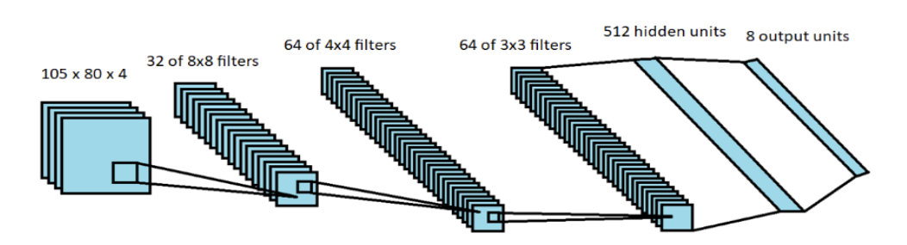

# Deep-Q-Network

The project implements Deep Q-Network (DQN) with experience replay as our deep reinforcement learning model to train the agent to play the Space Invaders game that was imported from the Open-AI gym retro. It is important to note that the DQN is an existing deep reinforcement model which is trained with a variant of Q-learning algoriothm using the RMSprop optimizer to update its parameters, as it was choosen by a group of Deemind researchers in the paper for the Nature [1,2].

# Deep Q-learning with experience replay

The architecture of the network takes the last 4 video framers and feeds them into convolutional layers that are followed by f

